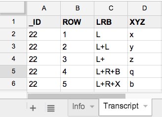

# valid-xlsx

A simple module and CLI for validation reporting on specified columns within an excel worksheet.

    validate --sheet=SheetName                      \
             --constraints=your.column.constraints.js file.xlsx

For the CLI, you pass in a file containing your column constraint functions.

## Usage

    npm install -g valid-xlsx
    npm run test
    npm run demo
    npm run cli-demo


## Example

Using the following sample file (`sample.xlsx`) ...




#### CLI

    validate --sheet=Transcript \
             --constraints=sample.constraints.js sample.xlsx

Output ...

    4 invalid values in `sample.xlsx:Transcript`

    LINE 4:
      LRB = `L+ ` is an invalid value
    LINE 5:
      XYZ = `q` is an invalid value
    LINE 6:
      LRB = `L+R+X` is an invalid value
      XYZ = `b` is an invalid value


#### Module

You'll typically require a file containing a constraints object:

```javascript
var validate = require('valid-xlsx');
var constraints = require('sample.constraints');

var file = 'sample.xlsx',
    sheet = 'Transcript'

var results = validate(file, sheet, constraints).report;

console.log(results);
```

This should yield the following results:

```javascript
{ errors: 4,
  file: 'sample.xlsx',
  sheet: 'Transcript',
  invalid: 
   { '2': [ 'LRB = `L+ ` is an invalid value' ],
     '3': [ 'XYZ = `q` is an invalid value' ],
     '4': 
      [ 'LRB = `L+R+X` is an invalid value',
        'XYZ = `b` is an invalid value' ] } }
```

The constraints object should contain functions to check the validity of column
values.  The key of each constraint function should reflect the name of the column values it validates.

In the example below, we define the constraints object inline.  It contains one
column constraint function, viz., a simple constraint on valid values for the `XYZ`
column:

```javascript
var validate = require('valid-xlsx');

var file = 'sample.xlsx',
    sheet = 'Transcript',
    constraints = {
        XYZ: function(v) {
            if (v) {
                if (!/^[xyz]$/.test(v)) {
                    return v + ' is not a valid value!';
                }
            }
        }
    };

var results = validate(file, sheet, constraints).report;

console.log(results);
```

This produces the following results:

```javascript
{ errors: 2,
  file: 'sample.xlsx',
  sheet: 'Transcript',
  invalid: 
   { '3': [ 'q is not a valid value!' ],
     '4': [ 'b is not a valid value!' ] } }
```
